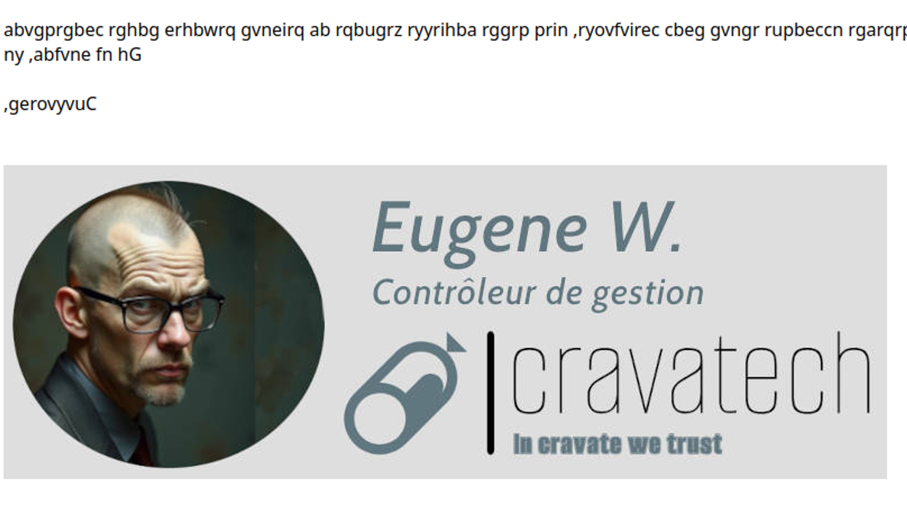
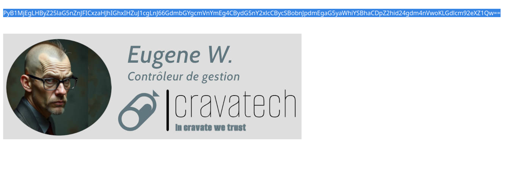
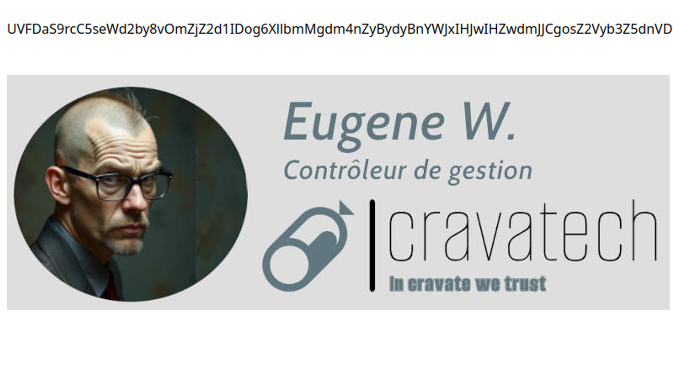
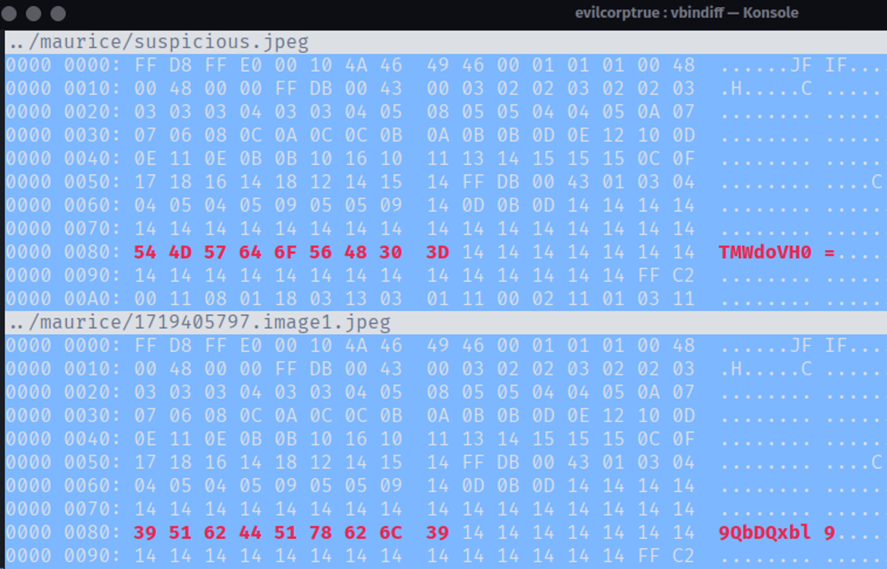
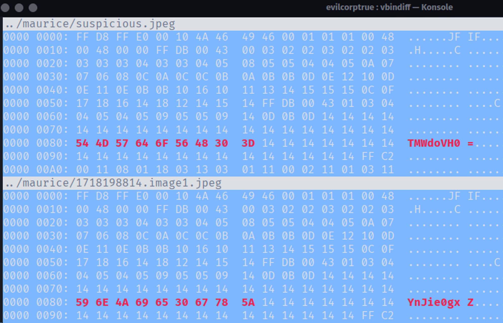

# Presentation du chall

Lors de ce challenge de forensic, mon premier challenge de cette catégorie, lors du Barb’hack 2024, on nous indiquait qu’un flag avait été envoyé par un des employés de l’entreprise fictive ‘Cravatech’ via mail. On nous fournissait un dump.zip contenant ~150 mails sous format .eml.

# Processus

Le premier pas naturel fut de lire ces mails puis de les trier par expéditeur, car nous savions qu’un de ces employés était coupable.

Nous avons identifié 8 employés, chacun ayant un sujet de conversation particulier :

Alphonse : se plaignant au directeur d’un souci de parking de vélo, aucun signe particulier ni dans le texte ni dans les en-têtes ne donnait d’indice.

Huguette : directrice du CSE, les mails mettent en avant des bons plans peu intéressants, aucun indice particulier.

Marc-Hubert : le chef du syndicat qui se bat pour les droits d’un employé avant de céder aux joies de la corruption pour le plus grand bonheur de son neveu Jean-Kevin. Là aussi, aucun indice ne se trouve dans les mails.

Camille : achetant un nouveau produit, on remarque au fur et à mesure de ses mails qu’une lettre est en majuscule sans se trouver en début de mot. En regroupant ces lettres, nous trouvons ‘G O O D L E A D B U T N O T D A F L A G’, notre premier rabbit hole.

Hubert : organisant des réunions et signature de contrats avec un certain Demasmaker travaillant chez [evilcorp.io](http://evilcorp.io/). Bien que le nom de domaine soit tendancieux, une recherche sur celui-ci ne remontait aucune information et les mails ne contenaient pas forcément plus d’informations.

Siméon : le directeur logistique proposant chaque jour un menu, on pouvait penser que la formulation du mail avec un retour à la ligne particulier pouvait laisser penser à un acrostiche. Malheureusement, on se rend compte que les chaînes formées de cette manière ne donnaient rien.

Maurice : un vendeur âgé, qui donne l’impression de ne pas bien connaître la technologie de par sa difficulté à envoyer une pièce jointe. Après plusieurs mails à vérifier si la pièce jointe ne se cachait pas dans les en-têtes en vérifiant avec des outils comme EML Analyzer, rien d’autre ne ressortait à part la signature emblématique de l’entreprise, en JPG, montrant le nom de l’employé et son poste, et commune à tous.

Eugène : la conversation la plus intéressante, il demande à Philibert des informations et essaie de cacher son message de plus en plus.


La syntaxe et le nombre de lettre de la première ligne (ses mails ont toujours commencés par Philibert) fait automatiquement pensé à un chiffrement de césar, un tour via [dcode.fr](http://dcode.fr) permet facilement de trouver le message clair :

```html
Philibert,

Avec cette méthode, on devrait pouvoir contourner les filtres du systéme, pour sécuriser nos rchanges.
```

le second mail :



On remarque que le string a été reverse, tout en étant initalement chiffrer en rot-13.

En appliquant le traitement inverse on obtient :

```html
Philibert,

Tu as raison, la precedente approche etait trop previsible, avec cette nouvelle methode on devrait dejouer toute protection
```

le mail suivant :



le ‘==’ est souvent signe d’un chiffrement en base64, un petit tour sur cyberchef suffit : on obtient encore une fois une string reverse et en rot 13 , le déchiffré est le suivant :

```html
Philibert,

J'ai ajoutr un nouveau niveau de cryptage n notre systrme. J'ai du neuf, Restauratec, 12h ?
```

L’avant dernier mail :



toujours du base 64 reverse et rot 13, une recette sur cyberchef donne :

```html
Philibert,

Voici ce dont je t'ai parlé : https://bitly.cx/vPDD
```

le sentiment d’avancement est retombé bien vite quand le lien cache …. une redirection youtube vers un RickRoll…

le mail suivant lui aussi chiffrer nous enfonce encore plus :

```html
JE T'AI BIEN EU GROS NAZE, TU VOIS CE QUE CELA FAIT !
```

Suite à l’analyse de tous ces mails (et beaucoup de cheveux perdus sur tous ces rabbit holes…) il ne restait qu’un seul point que je n’avais pas forcément identifié plus que ça : les signatures en JPG encodées en base64.

Tout d’abord, j’ai dû faire un script afin d’extraire les images en base64 et de les exporter en JPG (cf [ExtractJPG.py](http://extractjpg.py/)).

Ensuite, une recherche visuelle pour inspecter un changement de pixels pouvant indiquer un possible transfert du flag dans l’image elle-même.

Utilisation d’outils de stéganographie comme zsteg / outguess / binwalk / strings à la recherche possible d’une chaîne en clair au format brb{flag} ou alors chiffrée.

Aucun résultat concluant. Vu que les signatures, au nombre de 8 modèles différents, chacune en 20 exemplaires, étaient rangées dans des dossiers séparés selon l’expéditeur, j’ai décidé de vérifier si tous les hash correspondaient, afin de possiblement déceler une image cachant un indice.

J’ai fait un script (cf [ChecksumCompare.py](http://checksumcompare.py/)) afin de calculer le checksum d’une signature et de le comparer avec celui des autres signatures présentes dans le dossier.

Un seul dossier semblait présenter des signatures visuellement semblables mais avec des checksums différents, celui de Maurice.

Il ne me restait plus qu’à utiliser VBinDiff afin de vérifier ligne par ligne la différence entre les hexadécimaux de chaque signature.

On se rend compte que sur la partie 000000x80, les 9 derniers bits sont différents :


on voit donc bien une string particulière apparaitre ! :`TMWdoVH0=`

une recherche sur les 20 autres images nous donneras au total 4 strings : 






les strings sont :
`"GQzbl8xbl", "9QbDQxbl9", "YnJie0gxZ", "TMWdoVH0="`

et on peut voir que le dernier string finit par un ‘=’ donc potentiellement un chiffrement en base64 !

En créant un script (cf  decrypt.py) qui va concatener les strings et de tenter un déchiffrement jusqu’à avoir une string complète qui une fois déchiffrer donne un flag au format brb{flag}

A la fin de l’execution nous obtenons le flag :


